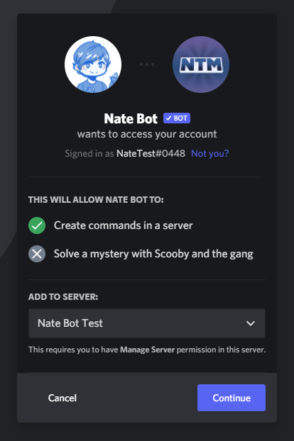

# Invite Troubleshooting

If you can't find your server in the dropdown, this can be caused by various reasons. First, you should make sure that you're signed into the correct account. If you're not, then click on the blue <kbd>Not you?</kbd> text.

Alternatively, inviting the bot through the Discord Client should always guarantee that you are on the correct account. Otherwise you can logout and login to the correct one if you are on the wrong one.

If you're **100%** sure that you're signed into the correct account, then you should make sure that you have the correct permissions. In order to add a bot, you need to have a role with the **`Manage Server`** or **`Administrator`** permission. If you're the server owner, you have those regardless, of course.

::: tip
Is your **account unverified?** Then you should verify it with your email address and/or phone number.
:::
