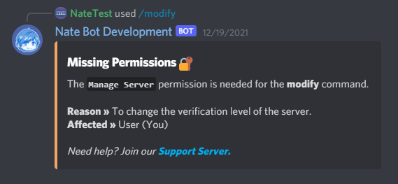
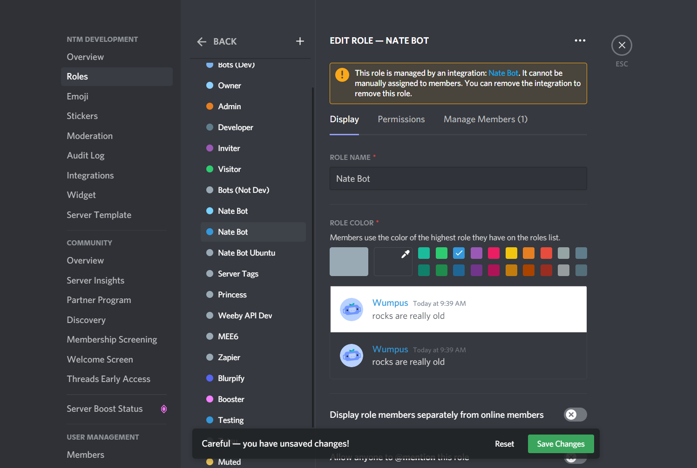
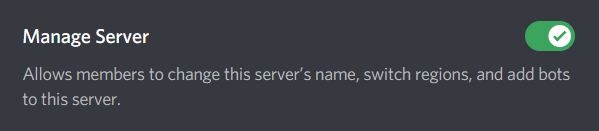

# Why is Nate Bot missing permissions?

Sometimes, it can be very frustrating to deal with missing bot permissions. Especially when it comes to giving and removing roles.

For this example, we are trying to get Nate Bot to correctly use the Settings Command, it will need the **`Manage Server`** permission.

Without the permission, it will send this:

> You will need to grant this permission to Nate Bot by giving it a role with the **Manage Server** permission.

To fix this, go to your **Discord server setting** then click on **Roles**. Then, click on **Nate Bot**'s role, then **Permissions** and make sure it has the **`Manage Server`** permission.

If Nate Bot was assigned a role automatically on Server Join. It will display an Orange "**Managed by an integration**" box above the Role Name.

After you have enabled the permission. Click <kbd>Save Changes</kbd> and now Nate Bot will have permissions to change server settings depending on what you want the bot to do.