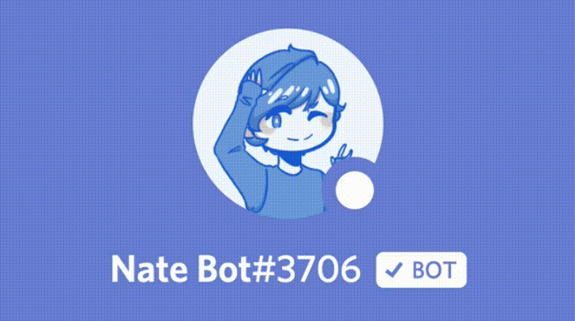

# Nate Bot is not responding?

First, make sure that Nate Bot is online and running as expected:

When there is a Green Dot and the Box shows "**Online**". It means Nate Bot is online.
If Nate Bot is indeed offline, there are two places you can check the Status of Nate Bot:

​- [Our Discord Server](https://discord.com/invite/G2rb53z) (Best Place)
- [​Status Website​](https://uptime.ntmnathan.com/)

If we are aware that Nate Bot is down, you shouldn't be able to send messages or anywhere and there should be a Status message that is sent in our **`#status`** channel.

::: tip
In the event of Nate Bot being offline and the Developers are well aware. There is nothing you can do, just be patient whilst we work on getting Nate Bot back online for you!

If Nate Bot is down without our awareness. You can let us know in the **`#bugs`** channel. Do not ping Developers or Staff Members, unless for an emergency.
:::