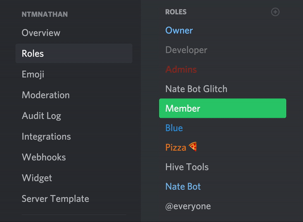

# The role is too low!

Nate Bot **cannot** perform certain actions (give roles, kick, ban etc.) when the role is too low in the hierarchy.

A simple solution is to move the role to a high enough position.

To fix this, go to your **Discord server settings** then click on **Roles**. Then, click on **Nate Bot**'s role and drag it all the way to a suitable position above other non server modifying perm roles.

::: tip
If Nate Bot is still showing you the error message, please join our [Support Server](https://natebot.xyz/discord) and we'll be happy to help!
:::