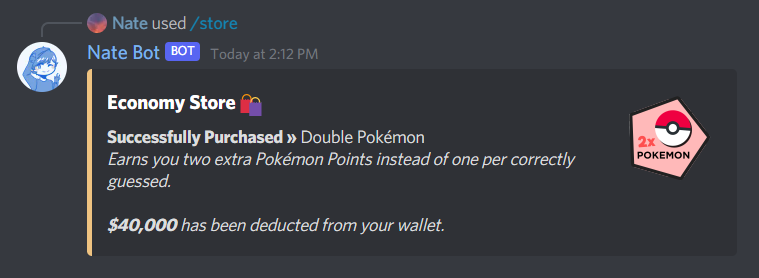

# Economy Store Guide
The economy store is the place to purchase backgrounds, badges and other items that can be used to customise and enhance your Nate Bot experience.

To get started, the base command is **`/store`** and a list of subcommands will be shown.

## Exploring the store
It is really easy to explore the store and see what items are available. In this example, we are going to look at the backgrounds category.

Here, there are a few options that appear in the category. When you select an option, an embed will send in the channel of the available backgrounds for purchase (in that category). This will show a preview of the backgrounds, the price and the ID of the background.

## Purchasing Items
All store items come with a unique ID which is used for purchasing and applying items (badges). To purchase an economy store item you need to run the **`/store buy`** command followed by the ID or name of the item you want to purchase.

::: warning
Item Names are case sensitive. It is usually preferred to use the ID instead of the name.
:::

## Shopping for Power-Ups
Power-Ups are a great way to boosting your Nate Bot experience and earning double the amount of Game Victories, Giving Reps, Giving Hugs and more! So to purchase a power-up, you need to run the **`/store powerups`** command and then, you need to select a transaction type.

- **Purchase**: Purchases a new Power-Up.
- **Sell**: Refunds half of the original price of the Power-Up.

### Purchasing
To purchase a power-up, run the **`/store powerups`** command, select **Purchase** and then the power-up you want to purchase.

Then an embed will be sent in the channel confirming the purchase.

### Selling
To sell a power-up, run the **`/store powerups`** command, select **Sell** and then the power-up you want to sell.

Then an embed will be sent in the channel confirming the sale, you will be refunded half of the original price of the power-up.

