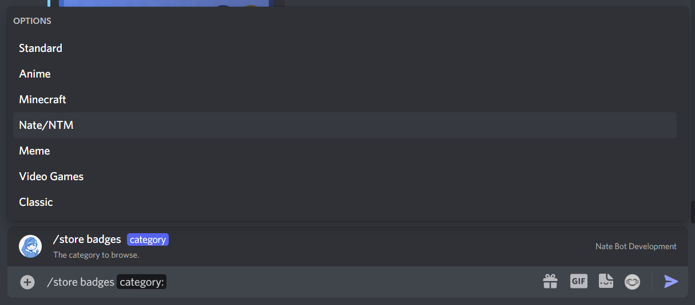
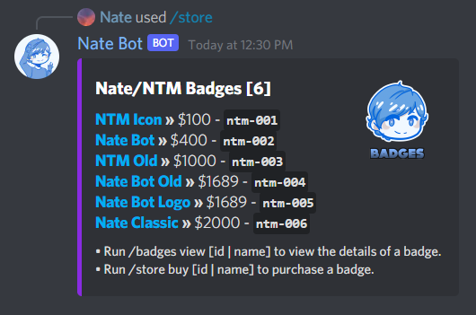
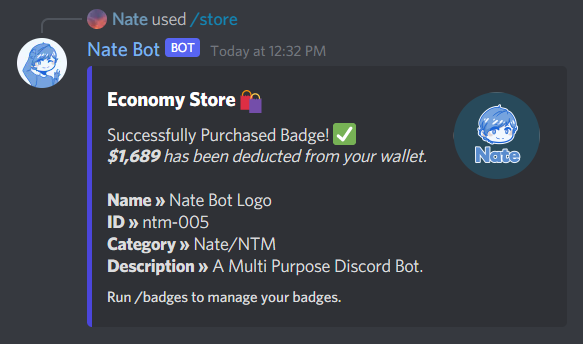
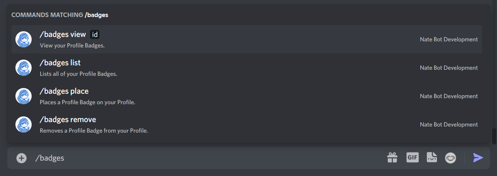
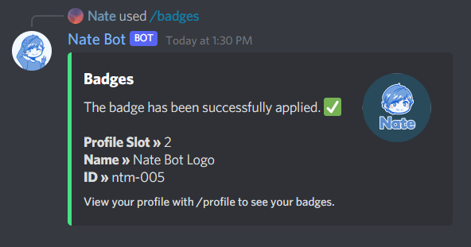
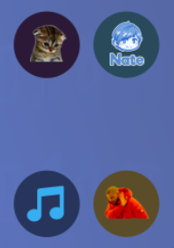
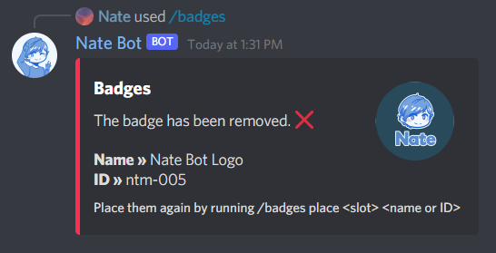
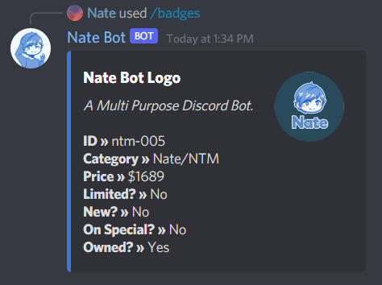
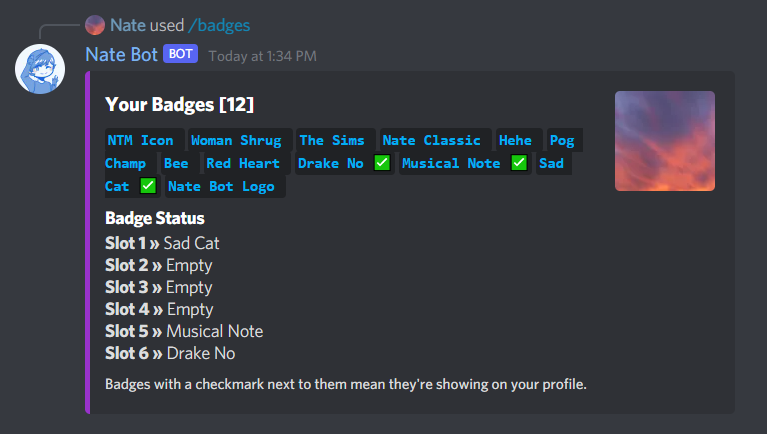
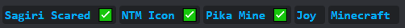

# How do I manage my badges?

## Buying Badges
To buy badges, you need to run the **`/store badges`** command and then select a category to view the badges.

Once you have selected a category, you can now view the badges in that category.

All badges have their own unique ID, which is used when purchasing a badge. So when you have decided on a badge, take note of that ID or name and then run the **`/store buy`** command followed by the ID or name of the badge you want to buy.

Then, an embed confirming the purchase will be sent in the channel:

## Managing your Badges
To manage your badges, just run the **`/badges`** command to get a list of subcommands that can be used to manage your badges.

To place a badge, run **`/badges place`** followed by the slot number (1-6) and the ID or name of the badge you want to place.

Then it will place on your profile and a success message will be sent in the channel.

If you want to remove a badge, run **`/badges remove`** using the same slot number and badge ID or name.

::: warning
Badge names are case sensitive. It is usually preferred to use the ID instead of the name.
:::

## Viewing Badges
If you want to view a badge, run **`/badges view`** followed by the ID or name of the badge you want to view. It will show some information about it and if you have it owned.

You can view your purchased badges by running **`/badges list`**.

Also, a green check mark means you have the badge applied on your profile.

