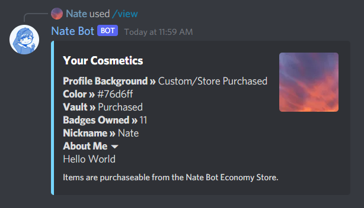
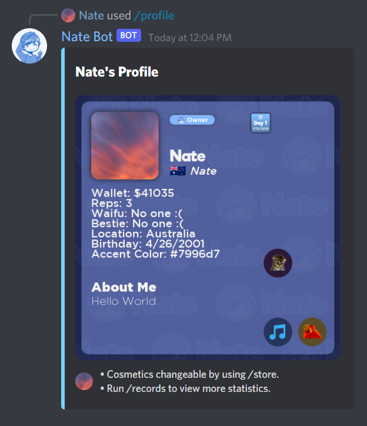
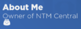
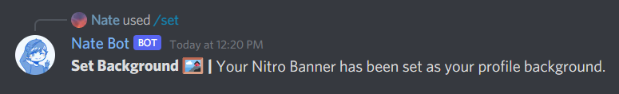
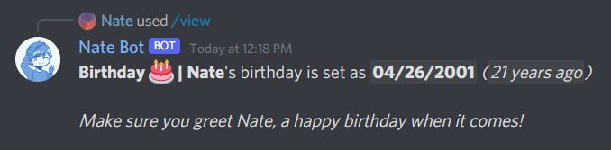

# How do I manage my cosmetics?

## Viewing your cosmetics
To view your cosmetics, you will need to run **`/view cosmetics`**.

## Viewing Profiles
The profile command is a visual representation of the cosmetics and records commands which is complete with your avatar, rank, special badges, economy badges and a background. You can view your profile by running **`/profile`** or right-clicking on a user and selecting **`Profile`**.

## About Me
This appears on the bottom of your profile card and you set it with **`/set info <text>`**. There can only be up to **116** characters with no profanity.

## Nickname
This appears underneath your Discord Username and you set it with **`/set nickname <name>`**. There can only be up to **16** characters and costs **$450** to change it...

## Background
Exclusive to Discord Nitro subscribers, users can place their Nitro Banner onto their Nate Bot profile card. Simply just run **`/set background`** and it will save and show on your profile. If it does not detect a Nitro Banner, it will default to the default background. Use at own risk.

## Location
This appears next to your nickname and is changeable with **`/set location <country code>`**. By default it is Antarctica and the country code must be a ISO 3166 Alpha 2 format. See this [website](https://www.nationsonline.org/oneworld/country_code_list.htm) to find all the valid country codes.

## Color
This appears on the side of the embed and as your profile overlay and you set it with the **`/set color <color hex>`**. You must provide a hex without the hashtag (#) and it is a **$650** fee to change it...

<DiscordMessages>
    <DiscordMessage profile="bot">
        <template #interactions>
			<DiscordInteraction
				profile="user"
				:command="true"
			>profile</DiscordInteraction>
		</template>
        		<template #embeds>
			<DiscordEmbed
				border-color="#76d6ff"
				embed-title="Nate's Profile"
                image="https://i.imgur.com/WxLagd9.png"
				footer-icon="https://i.imgur.com/U8SEa9L.jpg"
			>
				<template #footer>
					• Cosmetics changeable by using /store. • Run /records to view more statistics.
				</template>
			</DiscordEmbed>
		</template>
    </DiscordMessage>
</DiscordMessages>

## Birthday
This appears on your profile and on the **`/view birthday`** command, it can be set with **`/set birthday <MM/DD/YYY>`**.

