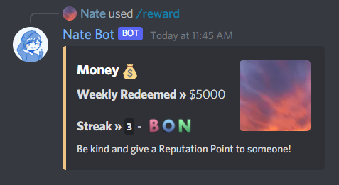

# What are streaks?
Streaks are tracked when you redeem your **Daily** and **Weekly** rewards! These are an awesome way to have fun with our Economy System. When you reach a cap in the Streak. You get rewarded extra! Here is what is looks like:

### Redeeming your Daily Reward

### Redeeming your Weekly Reward

To earn bonuses, the following criteria must be met:
- **Daily**: After reaching streak 5, an extra between $1 and $400 is added to your wallet.
- **Weekly**: After reaching streak 3, an extra between $1 and $2000 is added to your wallet.

You can view your current streaks by typing **`/view streak`**