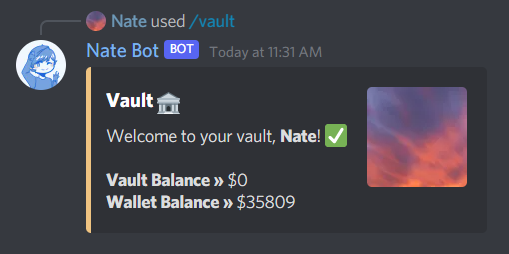

# The Vault
The vault key can be purchased from the Economy Store for **$80,000** and lets you deposit and withdraws your wallet balance for safe keeping, preventing users who run the **`/play rob`** from being able to steal your money.

To view how much you have in your vault, type **`/vault view`**.

## Depositing
To deposit money into your vault, type **`/vault deposit`** followed by the amount you want to deposit. Numbers must not contain any commas, decimals or be a negative.

## Withdrawing
Like the deposit sub-command, the withdraw sub-command is used to withdraw money from your vault. Just run **`/vault withdraw`** followed by the amount you want to withdraw.

