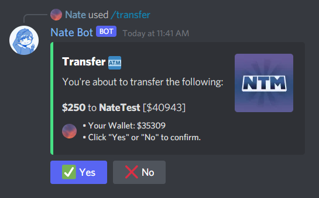
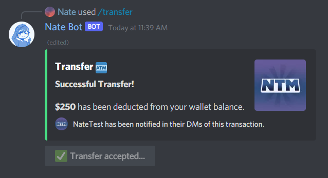

# Can I transfer money to someone?

To transfer money to someone, you can use the **`/transfer`** command followed by the amount you want to transfer and the user (who is in the server).

When you click **Yes** within **30 Seconds**, your wallet balance will be deduced and the amount that you provided will be transferred to the mentioned user. A message will be sent to the user's DMs from Nate Bot, lets them know they have been given this money!

