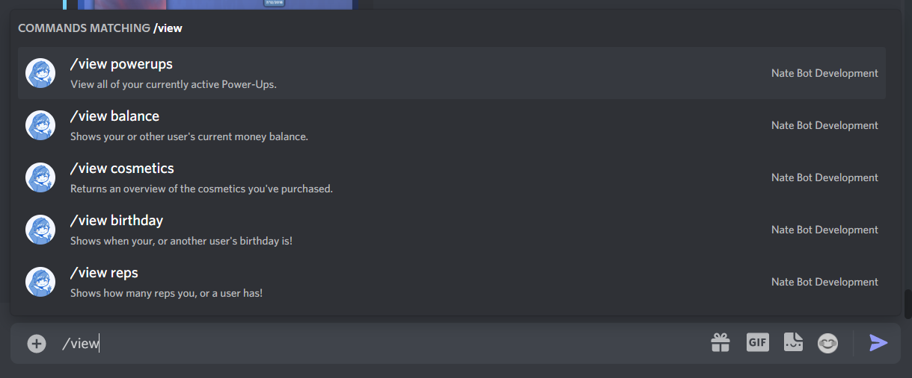

# How do I view my balance, reps etc.
Viewing statistics like your balance, reps etc. is very easy to do. Simply type **`/view`** to see a list of available sub-commands:

Then, for example you can type something like **`/view balance`** view your balance. You can alternatively provide a user to view their balance.

