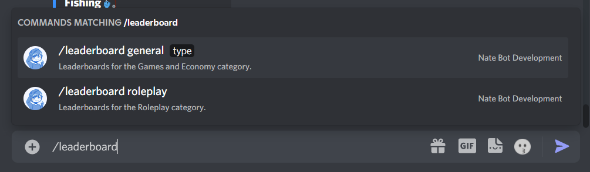
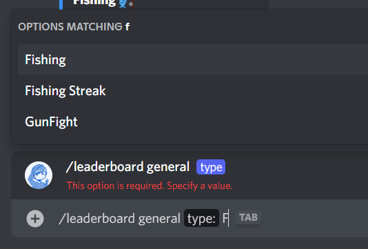
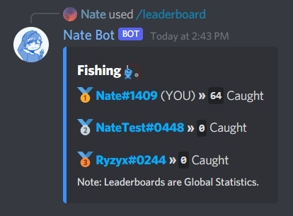

# How do I view leaderboards?
Leaderboards are a great way of competing against others for Points, Rewards and for the fun of it! The base command is **`/leaderboard`** command and comes with two subcommands:

In this case, we selected the **General** category and now we we can select a leaderboard to view in the options list.

Now, the leaderboard will load and then an embed will be sent in the channel with the Top 10 users. The Top Three has the numbers replaced by Medal Emojis which shows the top performing users.

::: tip
All statistics are not server based and are globally accessible.
::: 

::: warning
Data may get displayed incorrectly or some users could appear as **Unknown#0000**.
:::