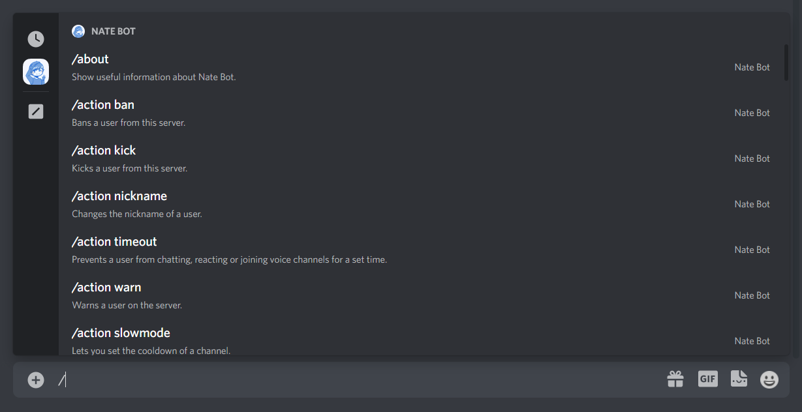

# How do I use the commands?

Nate Bot uses application commands which consist of slash commands and context menu commands. The slash commands can be found by typing `/` and then clicking on the Nate Bot icon. The system is very easy to use compared to prefixed commands (`n!`), especially in some commands where you don't have to really type anything! 

Context Menu commands do not require any parameters and are executed when the option is clicked. You can find these by right-clicking on a **user** or **message**, then Apps and then click on an option with the Nate Bot icon.

::: tip
These arguments are used when you are running commands:

`<>` - Required. 
`[]` - Optional.
:::

You may want to view a list of commands, just `/help category <name>` and Nate Bot will return all the commands for that category!

<DiscordMessages>
    <DiscordMessage profile="bot">
        <template #interactions>
			<DiscordInteraction
				profile="user"
				:command="true"
			>help</DiscordInteraction>
		</template>
        		<template #embeds>
			<DiscordEmbed
				border-color="#76d6ff"
				embed-title="Info Commands"
				thumbnail="https://i.imgur.com/8dVFSib.png"
				footer-icon="https://i.imgur.com/U8SEa9L.jpg"
			>
				<i>Useful links, info and stats.</i>  
                <code>about</code> <code>avatar</code> <code>credits</code> <code>help</code> <code>info</code> <code>link</code> <code>ping</code> <code>servericon</code> <code>stats</code>
				<template #footer>
					• Listing 10 Commands. • Run /help command &lt;name&gt; for Direct Command Help.
				</template>
			</DiscordEmbed>
		</template>
    </DiscordMessage>
</DiscordMessages>

If you really want to get specific command help. You can run `/help command <name>` to get information about a command. Here is what it looks like:

<DiscordMessages>
    <DiscordMessage profile="bot">
        <template #interactions>
			<DiscordInteraction
				profile="user"
				:command="true"
			>help</DiscordInteraction>
		</template>
        		<template #embeds>
			<DiscordEmbed
				border-color="#5865F2"
				embed-title="Help for play"
				thumbnail="https://i.imgur.com/i828Vfq.png"
			>
				<i>Play a fun game such as dice, slots, blackjack, or roulette.</i>  
                <b>Usage »</b> /play &lt;sub command&gt; <b>Category »</b> Games <b>Cooldown »</b> 10 seconds <b>Enabled? »</b> No <b>Staff only? »</b> No <b>Permissions Needed »</b> Use Application Commands, Send Messages, Embed Links
			</DiscordEmbed>
		</template>
    </DiscordMessage>
</DiscordMessages>

::: tip A break down of what each line is about:
- **Usage** » How to use the command (contains the arguments).
- **Category** » The category that the command is from.
- **Cooldown** » The remaining time (in seconds) to wait before you can run the command again.
- **Enabled?** » If the command is enabled for public use.
- **Staff Only?** » If only Nate Bot Staff Members and Developers can use the command.
- **Permissions Needed** » Shows the required permissions for the Command. By default: `Use Application Commands`, `Send Messages` and `Embed Links`.
:::

::: tip Command Shortcuts:
- Pressing on <kbd>TAB</kbd> while you type slash command arguments will speed up the typing process.
- When you hover over a slash command or option, press <kbd>TAB</kbd>. It will type out the command or option for you.
- Use your arrow keys to navigate through the list of commands, or command arguments
:::