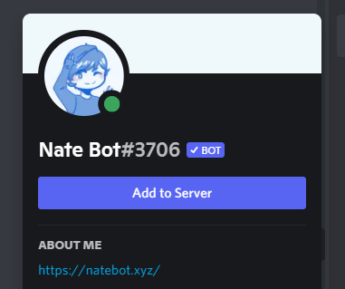
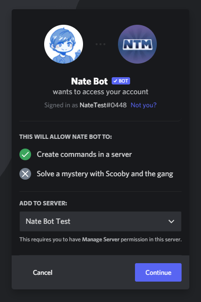
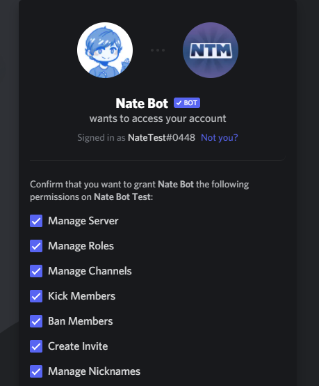
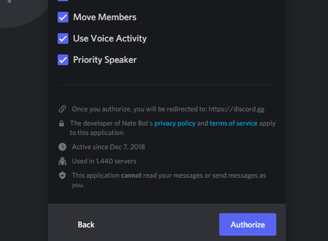
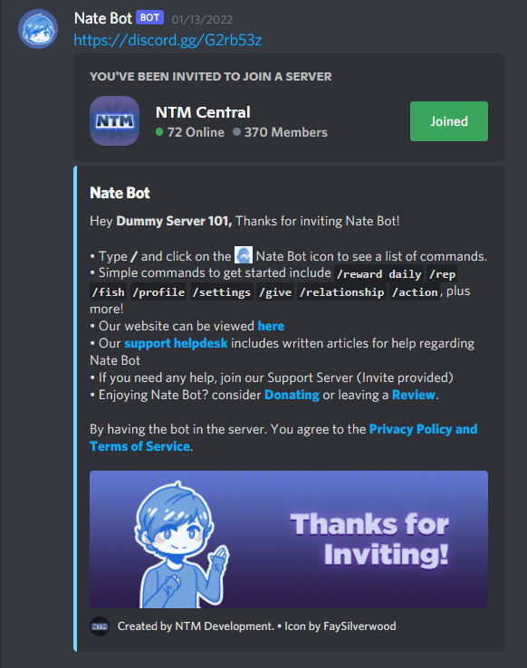

# How do I invite Nate Bot?

There are many ways to invite Nate Bot but the most secure way of inviting the bot to your server is by using this [link](https://natebot.xyz/invite), or by clicking the **Add to Server** Button. 

The invite link is found either by visiting the official website, bot list pages or by running Nate Bot commands.

**Step 1:** Visit ​[https://natebot.xyz/invite](https://natebot.xyz/invite).

**Step 2:** Make sure you're logged into the Browser Version of Discord, or you can use the built-in invite dialog on the Discord Client. That way you can select a server to invite Nate Bot to your server.

**Step 3:** Select the permissions that you want Nate Bot granted to. We will never ask for **Administrator** and/or **Mention Everyone**. After you've selected the permissions, click on <kbd>Authorize</kbd>. You might need to complete a captcha before it's in your server.

**Step 4:** Done! Nate Bot is now in your server and you are ready to use the bot.

::: tip
If you're having problems with inviting Nate Bot, you can read the ​[Invite Troubleshooting Guide](/common-problems/invite-troubleshooting)
:::
<!-- TODO: ^^ -->

::: warning
Do not fall for fake invite links. These invites may contain permissions (Administrator, Mention Everyone etc.) that can affect your server. We will never ask for those permissions during invitation.
:::

::: tip
If you are ever unsure about what Permissions are what. Join our [Discord Server](https://discord.gg/cmUFubKUtu) and our Staff will help you out!
:::