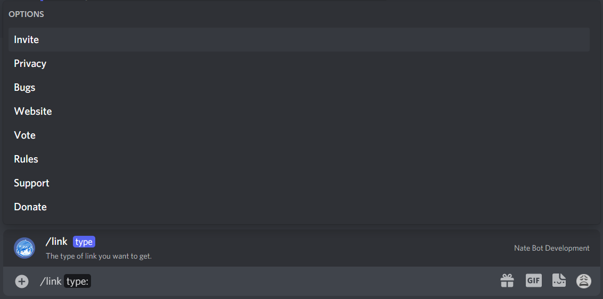

# Link Command(s) reference

The link command returns a link to a Nate Bot resource. All the links will come with a button which can be clicked to visit the desired website.

<DiscordMessages>
    <DiscordMessage profile="bot">
        <template #interactions>
			<DiscordInteraction
				profile="user"
				:command="true"
			>link</DiscordInteraction>
		</template>
		<b>NateBot |</b> Click either these buttons to access the Nate Bot Website(s):
		<template #actions>
			<DiscordButtons>
				<DiscordButton type="link" url="https://natebot.xyz/">🌐 Website</DiscordButton>
				<DiscordButton type="link" url="/">📚 Support</DiscordButton>
			</DiscordButtons>
		</template>
    </DiscordMessage>
</DiscordMessages>

The following options can be used with the link command:
