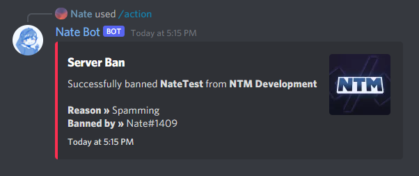
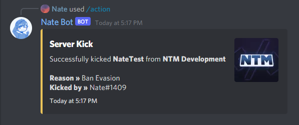
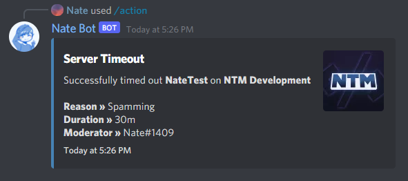
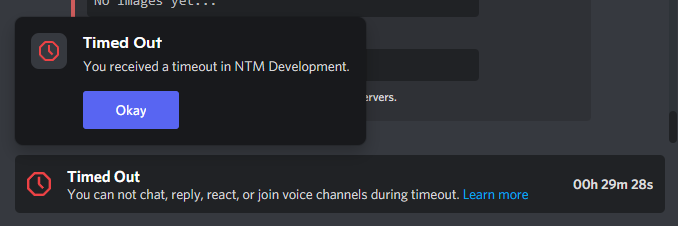

# Using the Action Command
The Action Command has a range of subcommands that can be used to moderate the server and combat rule breakers.

Base command is **`/action`** and this guide will explain how each works!

## Ban
The ban command is used to ban a user from the server who is breaking the rules. To ban a user, you must have the **Ban Members** permission.

Run **`/action ban`** to ban a user. You can optionally add a reason for the ban (there are pre-defined reasons you can choose if you like).

The user will be banned from the server and will get sent a message letting them know they have been banned.

## Kick
Similar to how the ban command works, the kick command is used to kick a user from the server. To kick a user, you must have the **Kick Members** permission.

Run **`/action kick`** to kick a user from the server.

## Timeout
The timeout is our integration of Discord's built in timeout feature. It is used to prevent a user from sending messages, reacting, join voice channels or video calls for a set amount of time.

To use the timeout command, you must have the **Moderate Members** permission.

Run **`/action timeout`** to timeout a user from the server along with the duration. A reason can be optionally added.

After the command is run, the user will be sent a message letting them know they have been timed out.

This is what it will look like when they're timed out.

## Voice Kick
This will kick a user from the voice channel they are in. You can optionally add a reason for the kick.

You must have the **Manage Channels** and **Move Members** permission 

To do this, run **`/action vckick`** and the user will be kicked from the voice channel.

::: tip
If you are looking for how to manage warnings, you can check out the [Warnings Guide](./warnings.md).
:::