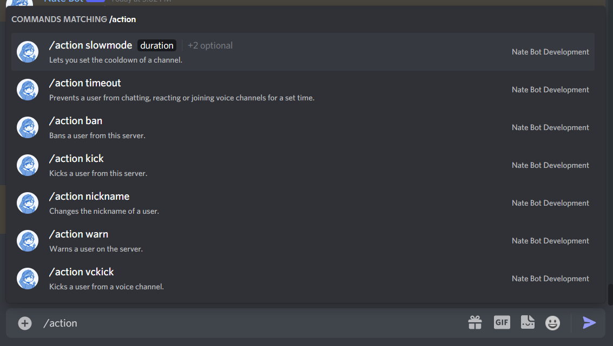

# Using the Action Command
The Action Command has a range of subcommands that can be used to moderate the server and combat rulebreakers.

Base command is **`/action`** and this guide will explain how each works!

## Ban

## Kick

## Timeout

## Voice Kick

## Timeout

::: tip
If you are looking for how to manage warnings, you can check out the [Warnings Guide](./utility/warnings.md).
:::