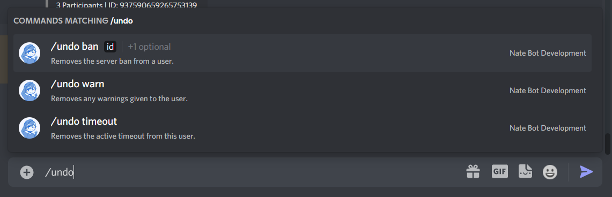

# Using the Undo Command
Made a mistake and want to undo something? You can use the **`/undo`** command to undo a ban, warning etc.

The Base command is **`/undo`**.

## Ban

## Undo

::: tip
If you are looking for how to manage warnings, you can check out the [Warnings Guide](./utility/warnings.md).
:::