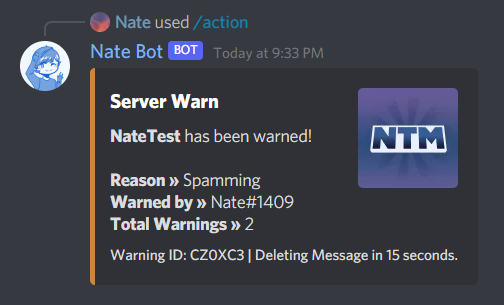
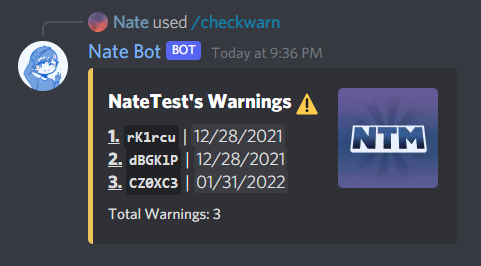
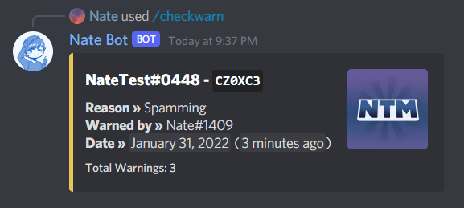
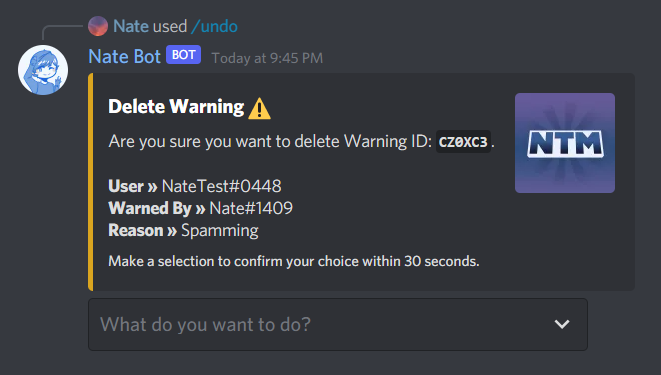

# Managing User Warnings on the server
Seeing someone doing the wrong thing on the server? You can easily warn users with our warnings system. The warning system is very simple to use and requries only a few commands to do so.

You will need to have the <kbd>Manage Messages</kbd> and <kbd>Kick Members</kbd> permission to use the warning system.

## Giving a warning
To give a warning to a user, you can use the **`/action warn`** command. Then select the user you want to warn along with the reason for the warning.

Then an embed will sent to let you know that the warning was given. They'll be sent a DM letting them know they have received a warning.

All warnings come with a unique ID which is used for when undoing the warning, or viewing the warning.

## Viewing a user's warnings
You can easily view a user's warnings by using the **`/checkwarn`** command followed by the user. Either provide the warning ID or leave blank to view all warnings for that user.

### Warn List

### Viewing a Specific Warning

## Removing a warning
To remove a warning, run the **`/undo warn`** command followed by the user and warning ID. Then you will need to confirm the removal by using the dropdown within 30 seconds.

There are two options:
- **Remove Warning** - This will remove the warning from the user.
- **Cancel** - Cancels the removal of the warning.

By selecting on **Remove Warning**, it will remove the warning from the user.

