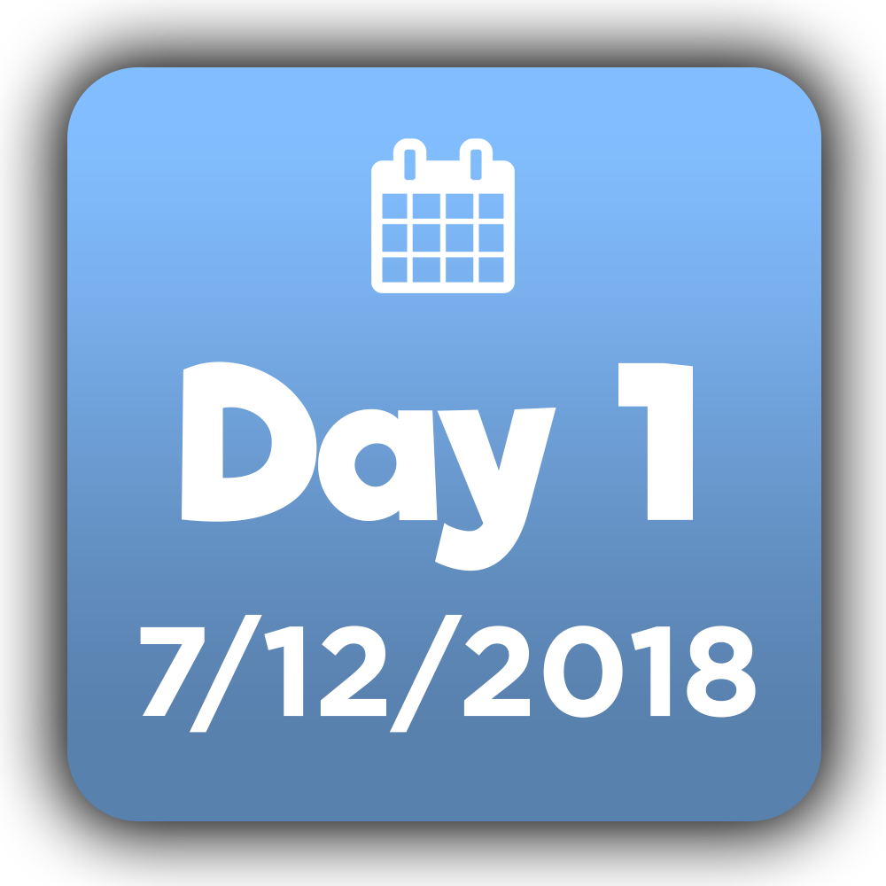
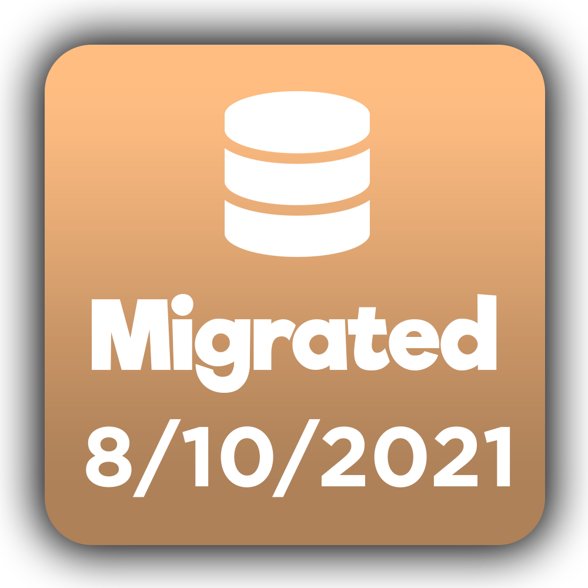

# Ranks

This article will help with all the Nate Bot Ranks. These only relate to the bot and not on the support server and cannot be obtained through any method other than what is describe below.

**Any requests for custom ranks will be ignored.**

## Global Ranks
The Global Ranks indicate the position and power of a user and it can be found displayed on the **`/profile`** or **`/records`** command.

### Regular

> The rank everyone starts with, and will have for the lifetime unless many circumstances arise.

### Donator

> Someone who supports the work of Nate Bot by donating will be given this rank.

### VIP

> A special rank that is given to a friend or really important person.

### Contributor

> Those who've contributed (e.g. ex developer, bug reporter) get this rank.

### Translator

> Those who've translated bot responses will get this rank.

### Developer

> Those who work for NTM Development on the Nate Bot project will get this rank.

### Owner

> The owner of Nate Bot is Nate (aka NTMNathan), he only gets this rank.

## Special Badges
### Day One

> Given to users who used Nate Bot from it's launch day (December 7th 2018).

### Migration

> Given to users who have migrated their account to the new database system (August 10th 2021).