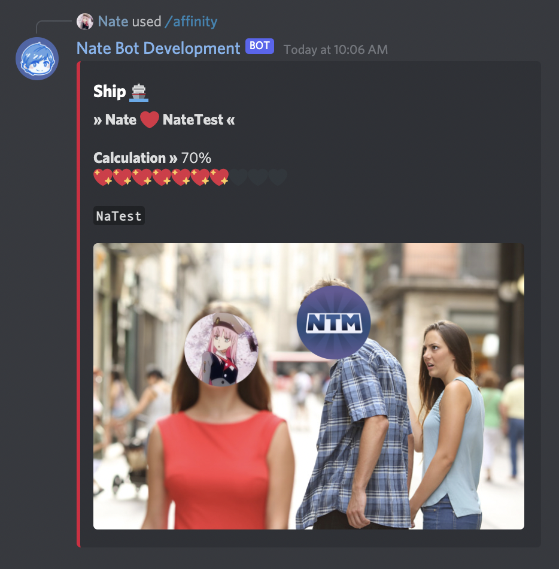
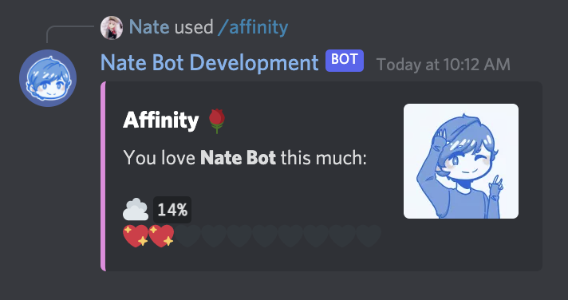
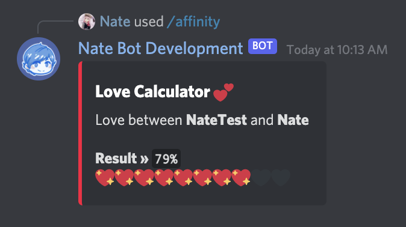

# How is the affinity command calculated?

## Ship
The ship subcommand requires two users to be mentioned. From here, it will calculate the percentage from **0-100%**. Every 10%, the heart progress bar is filled.

Then, a ship name is picked. The actual calculation formula is a secret but it is designed to determine the best ship name possible!

To ship users, run:
`/affinity ship <firstuser> <seconduser>`

## Calculate
The calculate subcommand requires the user to mention another user and it will result in a calculated rating out of **100**.

## Love Calc
Similar to the calculate subcommand, this will require two users to be mentioned and will return a calculation on a percentage from **0-100%**.

