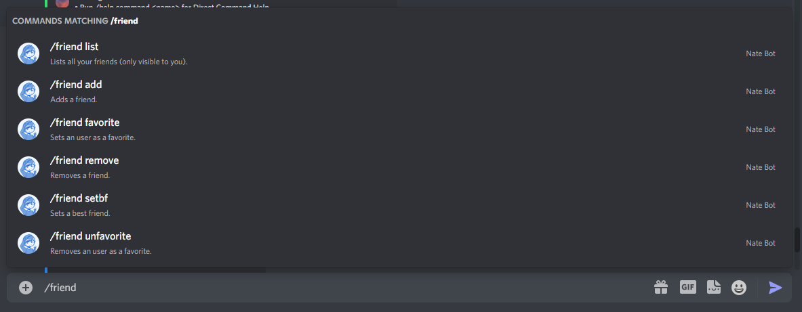
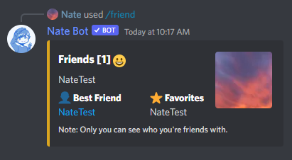

# Friends

With the Nate Bot friends system, you can add and remove friends easily. It is quite a simple and nifty system that comes a few subcommands to do so.

The base command is: **`/friend`**

## Adding a user as a friend
Making new (and old) friends can get simpler, all you need to make sure is that they are in the same server as you. Then you can run **`/friend add <user>`** and then the embed (shown below) will send two buttons for the other user to click.

- **Become Friends!** - Should you want to become friends with that user, then yes click this.
- **No Thanks** - Maybe next time, or think about. You can click this button if you wish to reject the friend request.

By accepting the friend request, the embed will update and you've been added to that user's friend list!

## Viewing your list of friends
Now that you added a friend, or removed a friend... maybe set a best friend. You can then view all your friends by running **`/friend list`**

You can only see who you're friends with.

## Removing a friend
Did something happen? or they are just inactive? No worries! All you need to do to remove a friend is run **`/friend remove <user>`** and you are then greeted with this message (in yellow).

You will need to confirm if you want to remove this user as a friend.

After you click **Breakup Friendship**, the embed will edit and return the following result.

::: tip
When you try to remove a user and Nate Bot cannot find the user, it will send a message letting you know that the friend data was reset.
:::

## Setting a best friend
The friends system is not complete without a bestie! You will need to run **`/friend setbf <user>`** and then that user will become your best friend. It will also show on your profile as well.

## Favoriting a friend
You can also favorite a friend by running **`/friend favorite <user>`**.

## Un-favoriting a friend
You can un-favorite a friend by running **`/friend unfavorite <user>`**.

