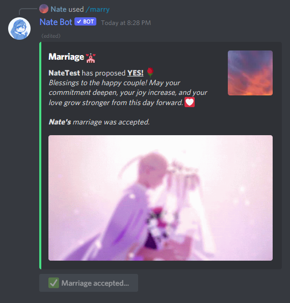
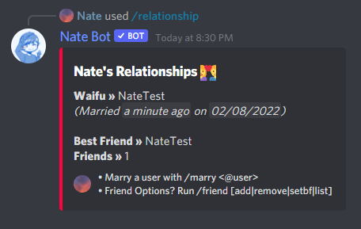

# Marriages
You can marry, or divorce user using the **`/relationship`** command. The following sub-commands are as listed:

## Marrying a User
Make sure you, and the user are in the same user as you. To marry a user, run the following command:
**`/relationship marry <user>`**

Once you do so, the confirmation embed will be sent for the other user to confirm by clicking the buttons.

If the user clicks **Yes, I do!**, You are now a married couple. Congratulations!

Now you can check the marriage status by running the **`/relationship view`** command. The embed will display information such as who you are married to, the date and the friends you have.

::: warning Caveats:
- If you are married already, you cannot marry another user. You must divorce the existing user before you marry someone else.
- If the user is already married to another user. Wait until they divorce.
- You cannot marry yourself or bots. (Stupid right?)
:::

## Divorcing a User
To divorce a user, you will need to run **`/relationship divorce`**. Then a confirmation embed will be sent which you will need to use to confirm with the buttons provided. You can provide the ID if you like to.

You will have two choices to make, click the button to confirm if you want to divorce. If you click **Confirm**, all you and the waifu's marriage data will be wiped and make you both single again.

## What if I cannot marry or divorce a user?
When you try to divorce and Nate Bot cannot find the user, it will send a message letting you know that the marriage data was reset. However, if you are experiencing more issues please reach out to our [Support Server](https://natebot.xyz/discord).