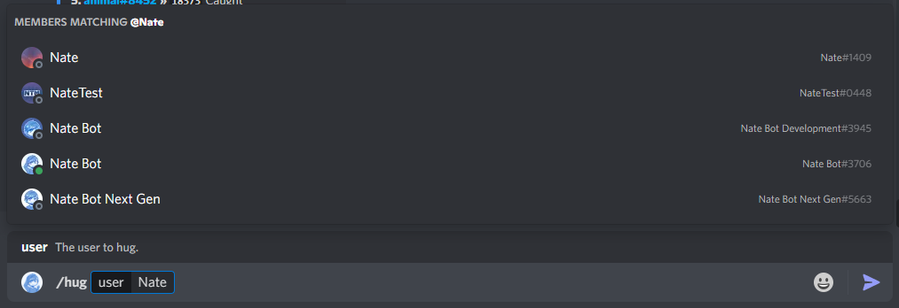
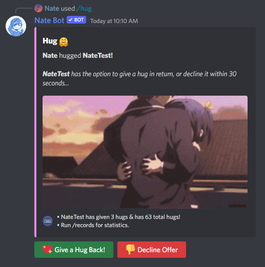
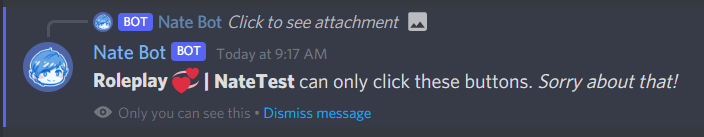
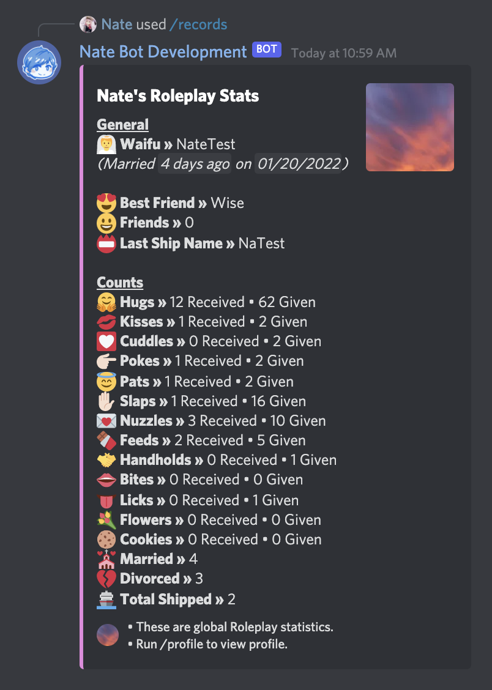

# Roleplay System Guide
The Nate Bot roleplay system features a unique system that is not implemented by other bots before. It has a statistics system and the ability to simulate giving a "lovely" something (a hug for example) back, or rejecting it with the use of buttons.

To start off, you will need to run one command:

**`/give <type> <user>`**

Then you need to select the type of roleplay action and a user.

Once you have finished typing out the arguments, it will return an embed with two buttons for the other user to click. That user can decide within **30 seconds** over what they want to do...

The following buttons can be clicked:
- **Give a "x" Back!** - Clicking this will give the other user the roleplay action back and they'll earn statistics as well.
- **Decline Offer** - This will reject the roleplay action offer.

Also trying to click the buttons yourself will send a dismissible message letting you know that the other user can click the buttons.

No activity on the buttons will result in the command timing out (embed edited) and the buttons being rendered un-clickable.

If you attempt to give a roleplay action to a bot or yourself. It will result in different outcomes.

## Statistics
To view your roleplay statistics, you can run the **`/records`** command and select the **Roleplay** type option.

It will return something like this:

- **Counts** statistics are obtained if you someone decided to use roleplay actions on you. On the other hand, the "Given" represents the number of times you have given roleplay actions.
- **General** statistics refer to your waifu (using the relationship command) and the friends (using the friends command).