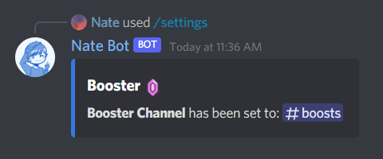

# Booster Notifications
The booster system sends messages whenever a user boosts the server, or has the server level up. It is very customizable from colors, messages and more!

The <kbd>Manage Server</kbd> permission is required to use this command.

Access all the booster commands by running **`/settings booster`**

## Setting Up
First, you need to run the **`/settings booster set`** command to set the channel. This is where the embed will be sent so users can see whenever the user has boosted the server, or the level has increased!

Then we need to toggle the Booster System **on** by running the **`/settings booster toggle`** command. Select the **True** option to enable it, **False** will disable it.

After that is all done, we can now test the Booster System! There are two types of Booster System messages, a Join and a Leave message. Simply run the **`/settings booster test`** command to test if the booster system is working!

Then when you think the Booster System is working as expected, you can now customise the Booster System messages with images, different colors etc. (more below).

To view the current Booster System settings, run the **`/settings booster view`** command.

## Color Customization
Now, lets customize the booster image colors! To do this, you need to run the **`/settings booster color`** command. Then select the type of color you want to change.

- **`Avatar`**: The user's avatar border
- **`Title`**: The "BOOST X" text color
- **`Description`**: The user's name color
- **`Message`**: The message that displays the server count
- **`Embed`**: The embed color strip when a user joins
- **`Level`**: The level up color

After choosing the color type, you can then provide the hex code for the color you want to change. Make sure the hashtag or other symbols are not included.

## Message Customization
This customizes the booster message in the embed (not image). To customize it, you need to run the **`/settings booster message`** then select the type of message you want to change. Then finally provide the message you want to set.

You can additionally use variables to have certain data display like the Server Name, User ID etc. [See below](#variables)! And also markdown is supported!

::: warning
Currently multi-line support is not available yet due to slash commands. This will be out in a later update.
:::
## Image Customization
By default, random Nate Bot images are used for the booster. If you want to use custom images, the recommended size is **1024x470**.

Simply run the **`/settings booster image`** command and then select whether if you want to **Add** or **Remove** an image. After that, provide a valid image URL to set the image.

## Variables
You may use these variables to display certain data in the message. Variables will need to use curly braces `{}`. To guarantee for the data to render properly, make sure both the user and bot is in the server!

**User:**
- **`{userName}`** - The user's name.
- **`{userTag}`** - The user's tag.
- **`{userID}`** - The user's ID.

**Server:**
- **`{serverName}`** - The server's name.
- **`{serverID}`** - The server's ID.

**Booster:**
- **`{userBoosterSince}`** - The date of when the user boosted the server.
- **`{boosterCount}`** - The server boost count.
- **`{boosterLevel}`** - The server boost level.