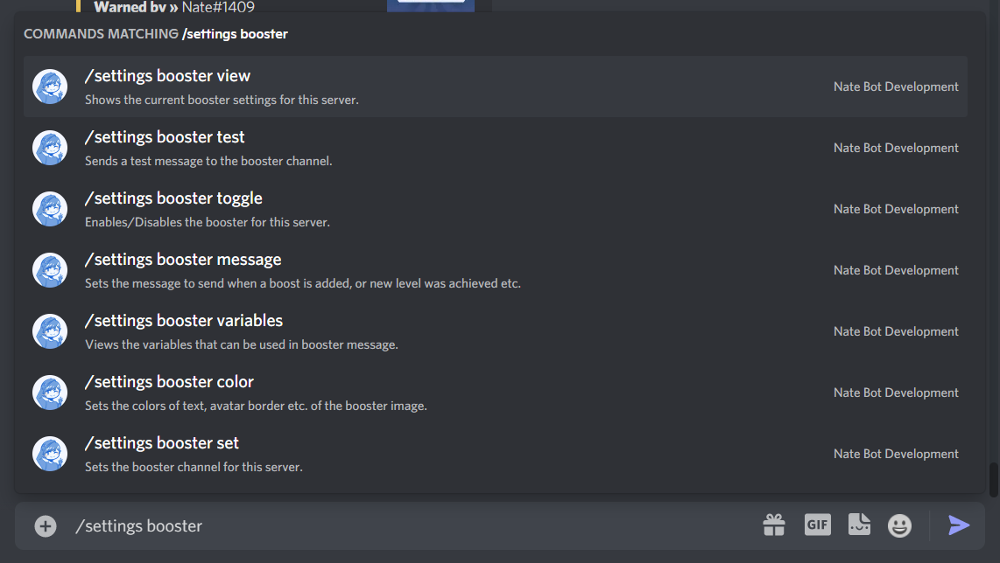

# Booster Notifications
The booster system sends messages whenever a user boosts the server, or has the server level up. It is very customizable from colors, messages and more!

The <kbd>Manage Server</kbd> permission is required to use this command.

Access all the booster commands by running **`/settings booster`**

## Setting Up

## Testing the Booster System

## Color Customization

## Message Customization

## Variables