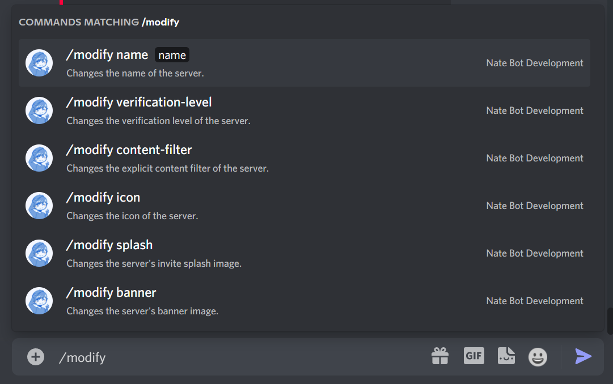
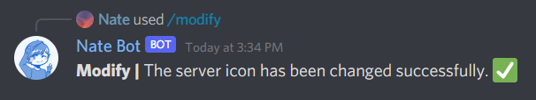
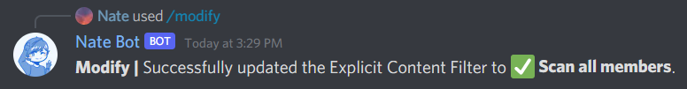
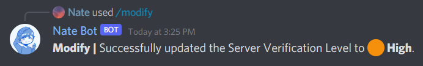

# Modify Command Guide
The modify command comes with a series of subcommands that allow you to modify various aspects of your server.

The base command is **`/modify`**.

The <kbd>Manage Server</kbd> permission is required to use this command.

## Server Name
This will allow you to change the server name. The name can be up to 32 characters long and all you need to do is run **`/modify name`**.

## Banner, Icon and Splash Image
This will allow you to change the server banner, icon and splash image. The images sizes are as follows:

- Splash Image: 1920x1080 - 16:9 aspect ratio
- Banner: 960x540 - 16:9 aspect ratio
- Icon: 512x512

You will need to provide a valid image url in the **`image`** parameter so it is recommended that you use a image hosting service such as [Imgur](https://imgur.com/) to upload your images.

Then run the following command(s):
- **`/modify banner <image>`** - Changes the server banner.
- **`/modify icon <image>`** - Changes the server icon.
- **`/modify splash <image>`** - Changes the server splash image.

## Explicit Content Filter
This changes the content filter level of the server. To change this, you will need to run the **`/modify content-filter`** command followed by selecting the level you want to change to.

- Scan media content from all members.
- Scan media content from members without a role.
- Don't scan any media content.

## Verification Level
This command allows you to change the server verification level. To change the verification level, you will need to run **`/modify verification-level`** and select either one of the following levels:

- ⚫ None - Unrestricted
- 🟢 Low - Requires Verified Email on Discord account.
- 🟡 Medium - Discord Registration longer than 5 minutes.
- 🟠 High - Membership longer than 10 minutes.
- 🔴 Very High - Requires Verified Phone on Discord account.

