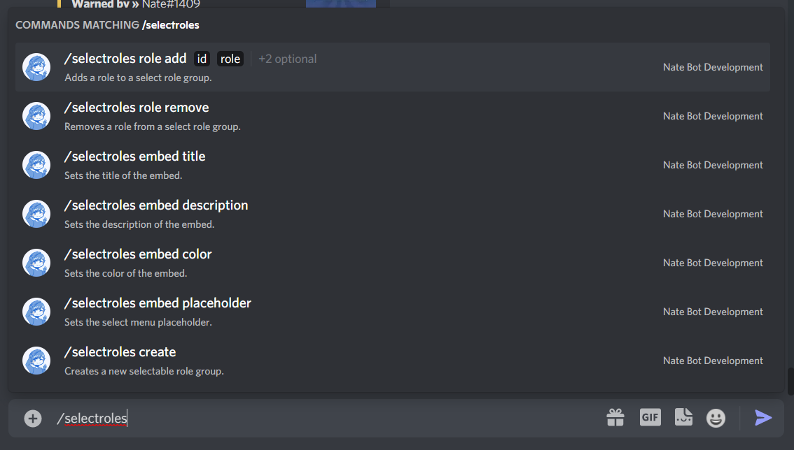

# Select Roles Guide
As a better alternative to Reaction Roles, select roles makes it easy to assign roles to users with the use of a dropdown.

The base command is **`/selectroles`**

The <kbd>Manage Roles</kbd> permission is required to use this command.

## Creating a Select Role Group

## Managing Roles

## Adding

## Removing

## Editing the Embed

### Title

### Description

### Color

### Select Menu Placeholder