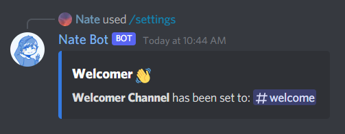
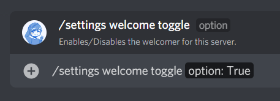
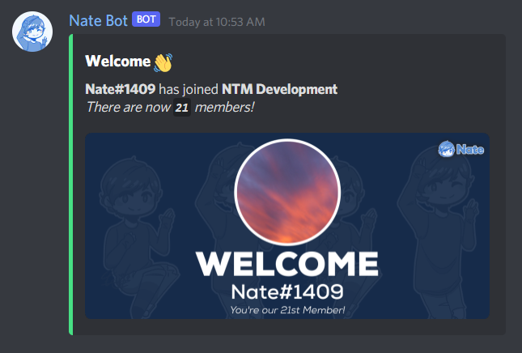
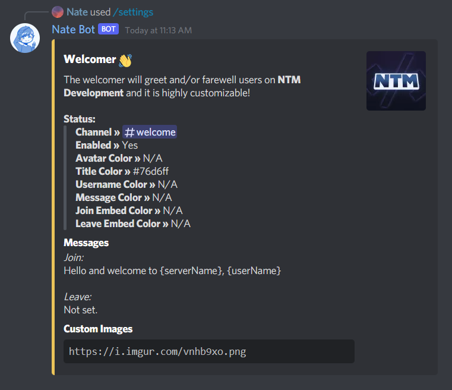
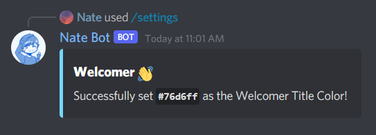
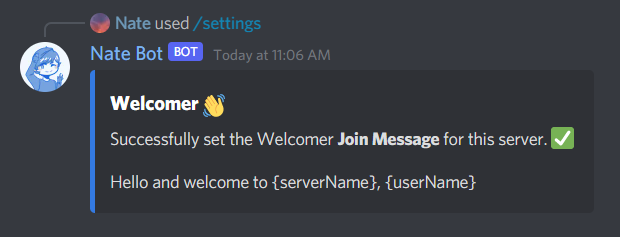
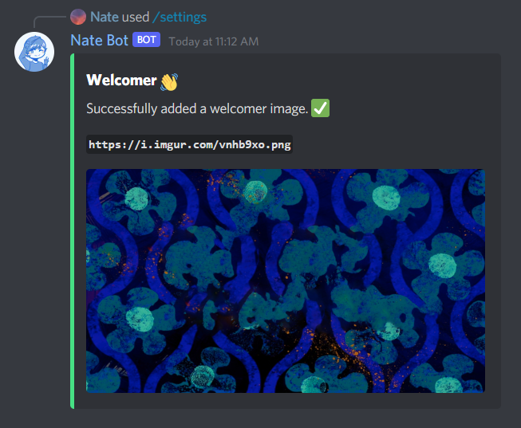

# Greet and Farewell Users
The welcomer is an automated welcoming system to welcome new server members. It sends an image when the member joins or leaves. To access all the welcomer commands, just run **`/settings welcome`**.

The <kbd>Manage Server</kbd> permission is required to use this command.

## Setting Up
First, you need to run the **`/settings welcome set`** command to set the channel. This is where the embed will be sent so users can see the welcome message!

Then we need to toggle the welcomer **on** by running the **`/settings welcome toggle`** command. Select the **True** option to enable it, **False** will disable it.

After that is all done, we can now test the welcomer! There are two types of welcomer messages, a Join and a Leave message. Simply run the **`/settings welcome test`** command to test if the welcomer is working!

Then when you think the welcomer is working as expected, you can now customise the welcomer messages with images, different colors etc. (more below).

To view the current welcomer settings, run the **`/settings welcome view`** command.

## Color Customization
Now, lets customize the welcomer image colors! To do this, you need to run the **`/settings welcome color`** command. Then select the type of color you want to change.

- **`Avatar`**: The user's avatar border
- **`Title`**: The "WELCOME" text color
- **`Description`**: The user's name color
- **`Message`**: The message that displays the server count
- **`Join Embed`**: The embed color strip when a user joins
- **`Leave Embed`**: The embed color strip when the user leaves

After choosing the color type, you can then provide the hex code for the color you want to change. Make sure the hashtag or other symbols are not included.

## Message Customization
This customizes the welcomer message in the embed (not image). To customize it, you need to run the **`/settings welcome message`** then select the type of message you want to change. Then finally provide the message you want to set.

You can additionally use variables to have certain data display like the Server Name, User ID etc. [See below](#variables)! And also markdown is supported!

::: warning
Currently multi-line support is not available yet due to slash commands. This will be out in a later update.
:::
## Image Customization
By default, random Nate Bot images are used for the welcomer. If you want to use custom images, the recommended size is **1024x470**.

Simply run the **`/settings welcome image`** command and then select whether if you want to **Add** or **Remove** an image. After that, provide a valid image URL to set the image.

## Variables
You may use these variables to display certain data in the message. Variables will need to use curly braces `{}`. To guarantee for the data to render properly, make sure both the user and bot is in the server!

**User:**
- **`{userName}`** - The user's name.
- **`{userTag}`** - The user's tag.
- **`{userID}`** - The user's ID.

**Server:**
- **`{serverName}`** - The server's name.
- **`{serverID}`** - The server's ID.
- **`{serverCount}`** - The server's member count.