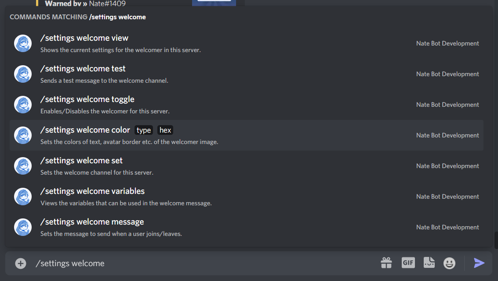

# Greet and Farewell Users
The welcomer is an automated welcoming system to welcome new server members. It sends an image when the member joins or leaves.

The <kbd>Manage Server</kbd> permission is required to use this command.

Access all the welcomer commands by running **`/settings welcome`**

## Setting Up

## Testing the Welcomer

## Color Customization

## Message Customization

## Variables