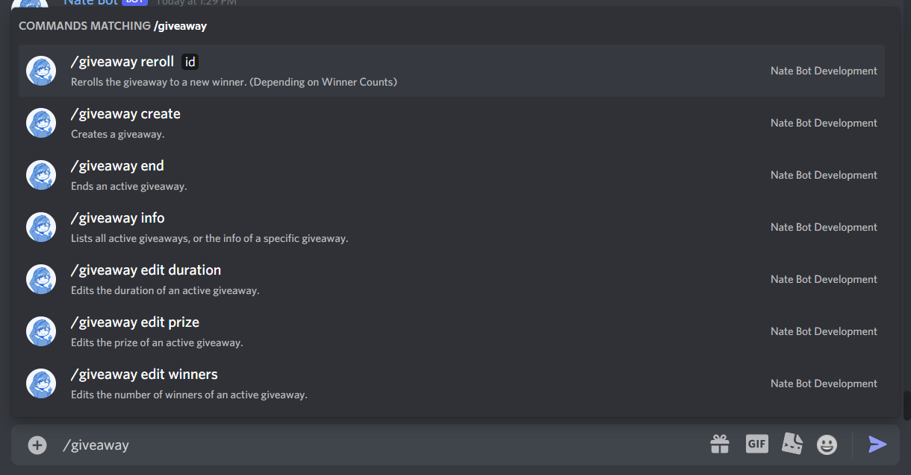
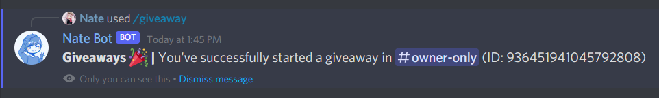
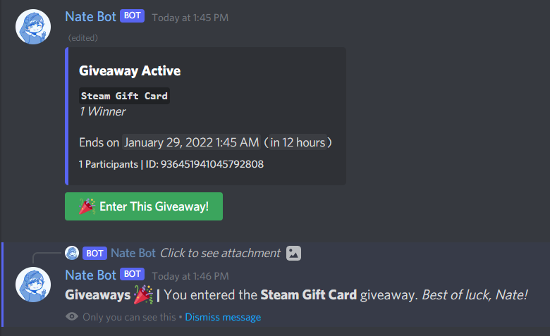

# Giveaways Guide
The giveaways system is a very intuitive system that allows you to create and manage giveaways in your server.

To view the list of command, you will need to type **`/giveaway`**, and it will return a list of available commands.

## Creating Giveaways
To create a giveaway, you will need to run the **`/giveaway create`** command followed by a text channel, number of winners, prize and time. Then run the command to start the giveaway. You should get a success message like this:

Now, users can enter the giveaway! Just simply click on the green **Enter This Giveaway** Button. A ephemeral response will send letting you know that you've been entered into the giveaway. Clicking it again will remove you from the giveaway.

## Editing Active Giveaways
### Prize

### Duration

### Winners

## Ending Giveaways

## Rerolling Giveaways

## Viewing Giveaways

## Notes
- Giveaways are checked every 1 minute and even if the bot restarts, the giveaway will still be checked.
- The giveaways system is custom coded and designed in-house. It does not use any external libraries such as `discord-giveaways`.