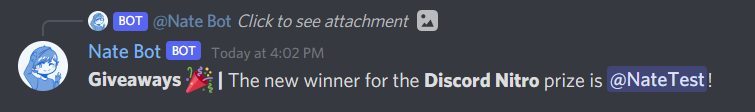

# Giveaways Guide
The giveaways system is a very intuitive system that allows you to create and manage giveaways in your server.

To view the list of command, you will need to type **`/giveaway`**, and it will return a list of available commands.

## Creating Giveaways
To create a giveaway, you will need to run the **`/giveaway create`** command followed by a text channel, number of winners, prize and time. Then run the command to start the giveaway. You should get a success message like this:

Now, users can enter the giveaway! Just simply click on the green **Enter This Giveaway** Button. A ephemeral response will send letting you know that you've been entered into the giveaway. Clicking it again will remove you from the giveaway.

When the time is up, the giveaway will automatically close and the winner will be selected by the bot. The system is designed to not be rigged, so the winner will be selected randomly.

## Editing Active Giveaways
You can modify an active giveaway's settings by running the **`/giveaway edit`** subcommand. Then select the command that you want to modify.

You will need to provide the Message ID of the giveaway you want to edit. The embed will edit with the new settings applied.

### Prize
To edit the prize of an active giveaway, run the **`/giveaway edit prize`** command.

### Duration
For the duration of the giveaway, you can run the **`/giveaway edit duration`** command. The duration will need to have a number followed by `m`, `h`, `d` and `w` as units. Minimum duration is 5 minutes.

### Winners
To edit the number of winners, run the **`/giveaway edit winners`** command. There can be a maximum of 20 winners.

## Ending Giveaways
Want to end a giveaway? You can run the **`/giveaway end`** command followed by the Message ID of the giveaway.

## Rerolling Giveaways
If you want to reroll the giveaway to have a new winner, you can run the **`/giveaway reroll`** command followed by the Message ID of the giveaway. This will reroll the giveaway and send a message with one new winner.

## Viewing Giveaways
To view the list of active giveaways, you can run the **`/giveaway info`** command.

Or if you want to get information about a specific giveaway, you can run the **`/giveaway info`** command. You will need to provide the giveaway ID which is a Discord Message ID (Snowflake).

## Notes
- Giveaways are checked every 1 minute and even if the bot restarts, the giveaway will still be checked.