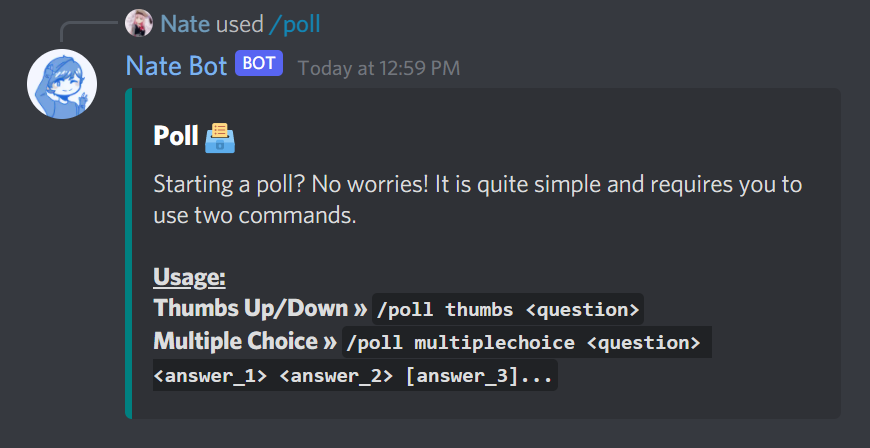
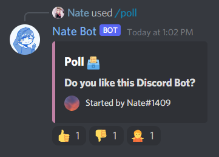
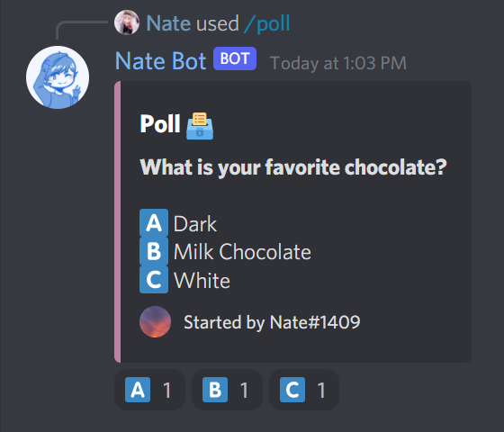

# How do I create polls?

To get started, run the **`/poll help`** command to learn how to create polls.

## Thumbs
This is a simple poll which will basically have three reactions, and a question.

- **`👍`** for agreeing
- **`👎`** for disagreeing
- **`🤷‍♀️`** for not sure

## Multiple Choice
This is a poll which will will allow for multiple options (up to 20), and a question.

