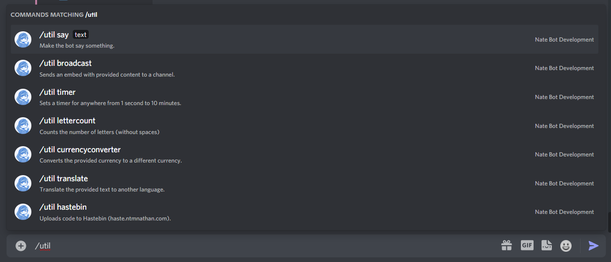

# Util Command Guide
Nate Bot comes with a variety of utility commands that are used for various purposes. You can find them by simply typing **`/util`** and then you can see a list of  available commands.

## Broadcast
You can easily create announcements on your server with Nate Bot. All you need to do is run the **`/util broadcast`** command followed by a Text Channel and a message to appear in the embed.

On success, a message (which deletes in 5 seconds) will send below letting you know that the announcement was sent!

This is what it looks like when you send the announcement in the channel:

## Say
To make the bot say something in a channel, you can run the **`/util say <text>`** command and then the bot will respond with the provided text.

Alternatively, you can use the **`/format`** command to format the text you want to send.

## Timer
To create a timer, you can run the **`/util timer <seconds> <reason>`** command and then the bot will start a timer, then stop with a success message.

## Currency Converter
Lets say you want to convert your currency to another one. You can run the **`/util currencyconverter <from> <to> <amount>`** command and the bot will convert the amount to the provided currency.

The `from` and `to` options will need to be a valid `ISO 4217` code. You can find a list of codes here: https://www.checkout.com/docs/resources/codes/currency-codes

## Translate
To translate text, you can run the **`/util translate <text> <from> <to>`** command and the bot will translate the text to the provided language.

The `from` and `to` options will need to be a valid `ISO2` code. You can find a list of codes here: https://www.checkout.com/docs/resources/codes/country-codes

